# HYPER//HIIT — User Manual

**Tactical Performance Interface for HIIT training**

---

## 1. Welcome

HYPER//HIIT is your command center for high-intensity interval training. Pick a **directive**, choose a **protocol**, and run it while the app handles the timing, calculates your calorie burn, and tracks your progress.

---

## 2. Main panel (Dashboard)

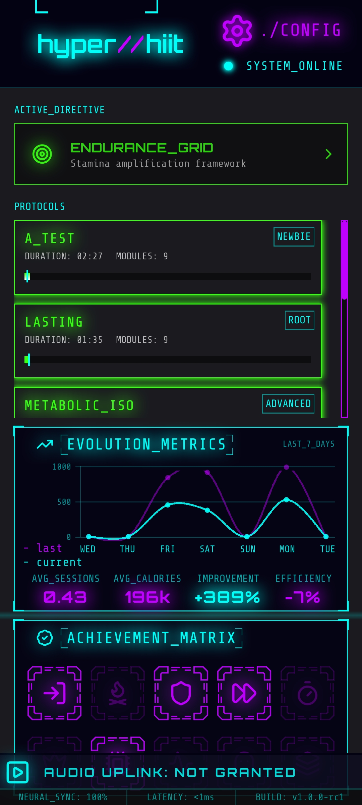

Opening the app takes you to the **Dashboard**, your home screen. Here you'll find:

- The active **directive** selector (at the top).
- The list of **protocols** available for that directive.
- Your **weekly evolution** (calories, improvement and efficiency compared to the previous week).
- Your unlocked **achievements**.
- The **SHUTDOWN** button, to exit the app.
- The gear icon (top right) to enter **Configuration**.

### Choosing a directive

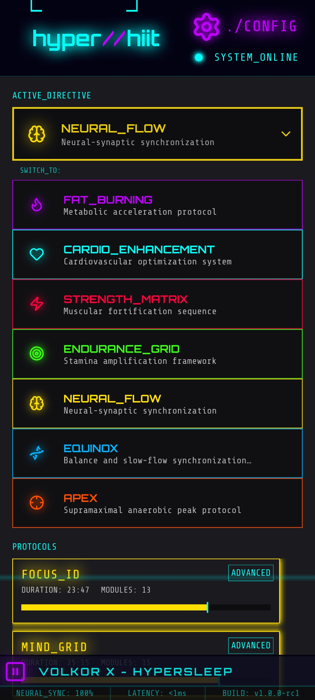

Tap the top dropdown to see all available directives (for example, strength, endurance, fat burning, etc.). Selecting one automatically filters the protocol list and changes the interface color to match it.

---

## 3. Protocol types

Each protocol belongs to a different training style. Tapping one from the Dashboard opens its **briefing** (technical sheet) before you start: rank, number of modules, estimated duration, and projected calories.

| Type | Description |
|---|---|
| **Tabata** | Short, very intense rounds with brief rests. Maximum demand in minimal time. |
| **AFAP** *(As Fast As Possible)* | Complete the set volume of work at a pace you can sustain. |
| **Other protocols** | Directives such as yoga or tai chi use their own dynamics (by breaths or by time). |

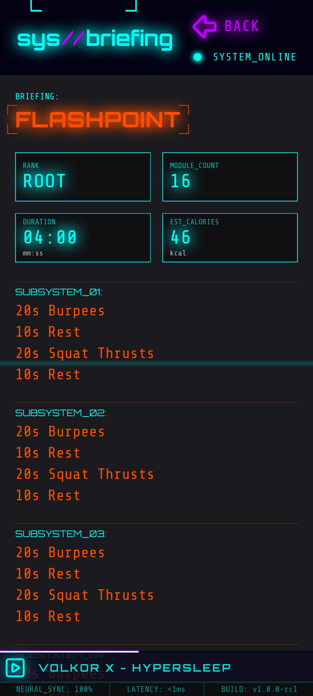
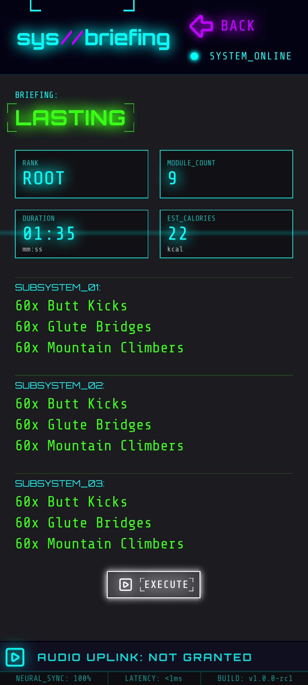
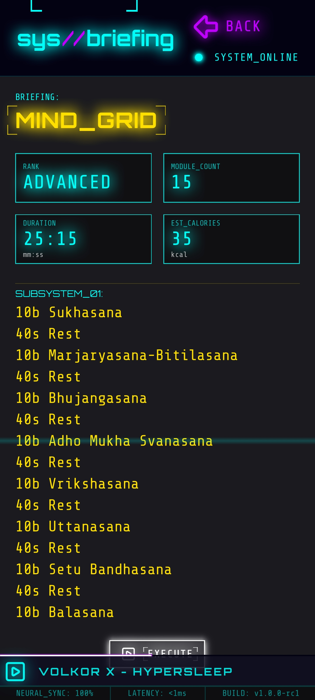

Once the briefing convinces you, tap **EXECUTE** to begin.

---

## 4. Running a session

### Countdown

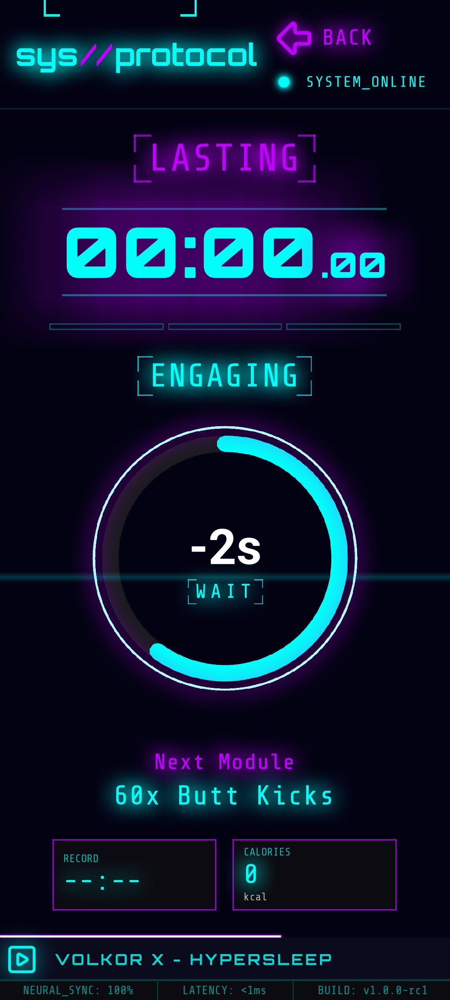

Every session starts with a preparation countdown. Use it to get into position: as soon as it hits zero, the first module begins.

### Real-time progress

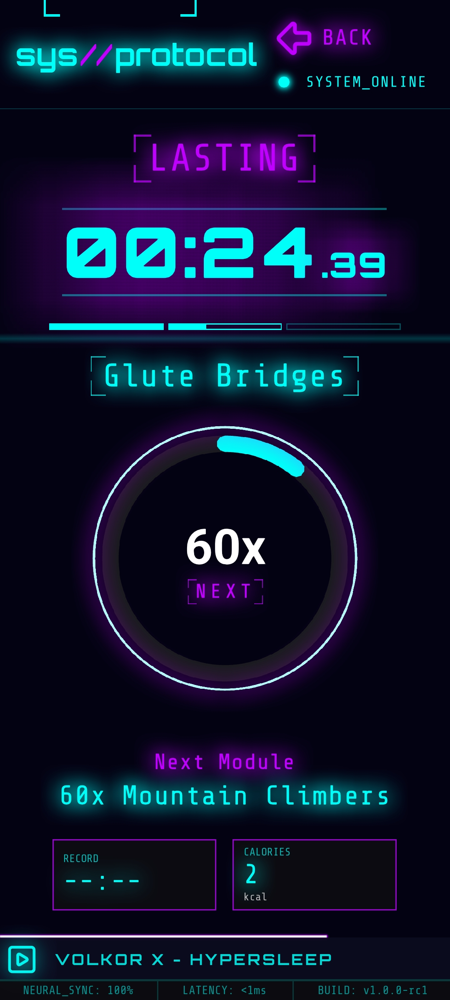

During the workout you'll see:

- The **current module** (exercise) and its quantity (seconds, reps, or breaths).
- A **progress dial** that fills up as the module is completed.
- The **next module** at the bottom, so you know what's coming.
- The **subsystem** indicator, marking which block of the routine you're in.

If the module is time-based, it advances automatically. If it's rep-based, it advances when you tap after finishing.

### Session summary

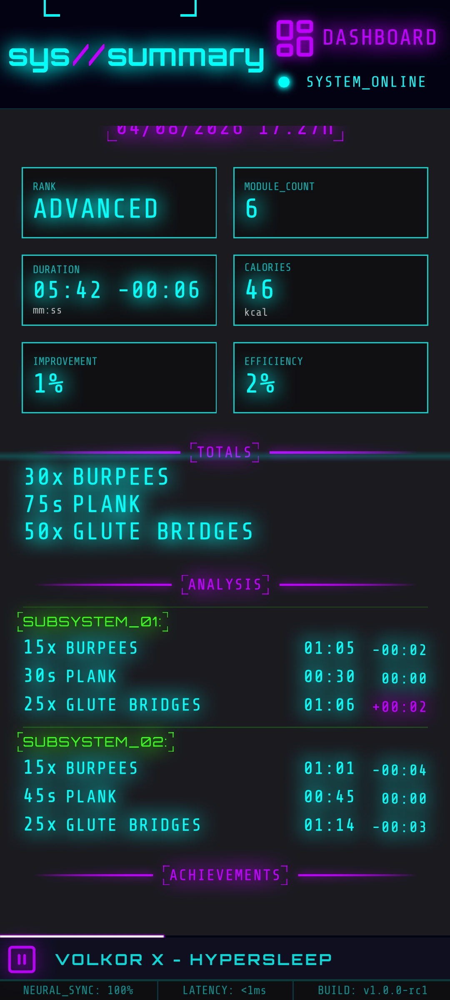

Finishing the protocol brings you to the **summary**: total duration, calories burned, improvement over your previous best, efficiency, and the achievements earned in that session.

---

## 5. Configuration

Access it from the gear icon on the Dashboard.

### User data

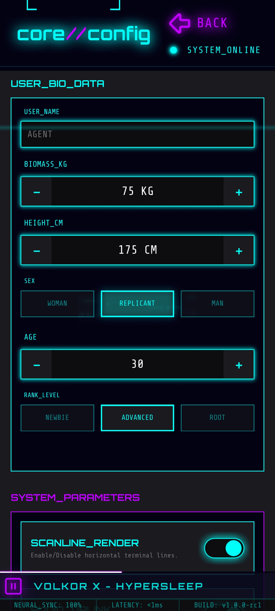

Here you set your name, weight, height, sex, age, and rank (newbie, advanced...). This data directly affects the calorie calculation, so it's worth keeping it up to date.

### System settings

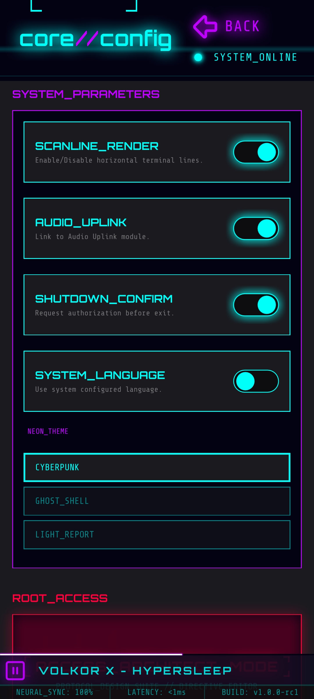

From here you control:

- **SCANLINE_RENDER**: turns the visual style's horizontal scanlines on or off.
- **AUDIO_UPLINK**: enables the app's audio player.
- **SHUTDOWN_CONFIRM**: asks for confirmation before exiting.
- **SYSTEM_LANGUAGE**: uses your device's configured language.
- **NEON_THEME**: switches the app's visual style between three themes: *Cyberpunk*, *Ghost Shell*, and *Light Report*.

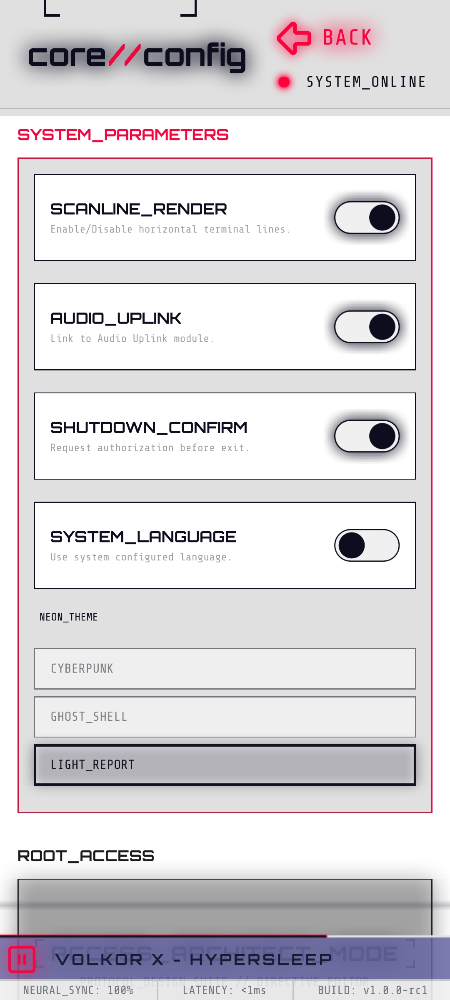

### Root access

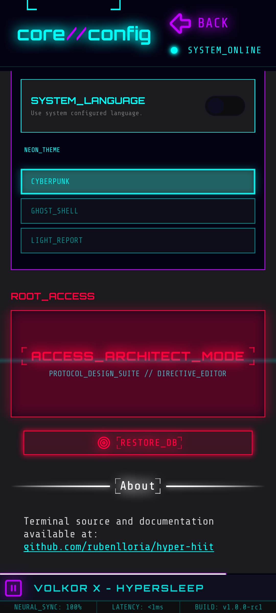

At the bottom of Configuration you'll find the **root access** area, reserved for advanced users:

- **ACCESS_ARCHITECT_MODE**: opens the directive, protocol, and module editor (see next section).
- **RESTORE_DB**: completely wipes the app's database. This action is irreversible, so use it with care.

---

## 6. Architect Mode (advanced editing)

**Architect Mode** lets you create and edit the app's training content: directives, protocols, and the modules (exercises) that make them up.

### Directives

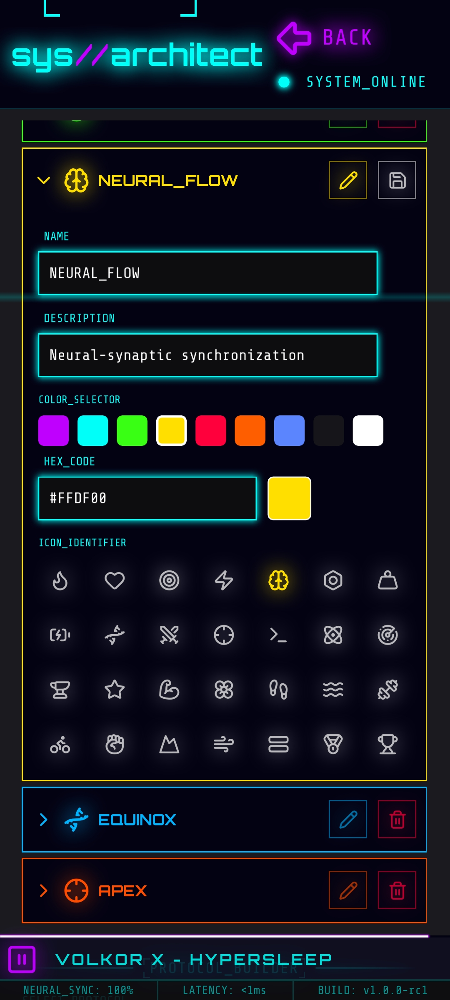

Here you can create new directives or edit existing ones: name, description, color, and icon. Tapping one expands its associated protocols.

### Selecting and editing protocols

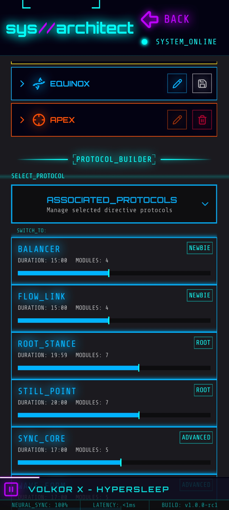
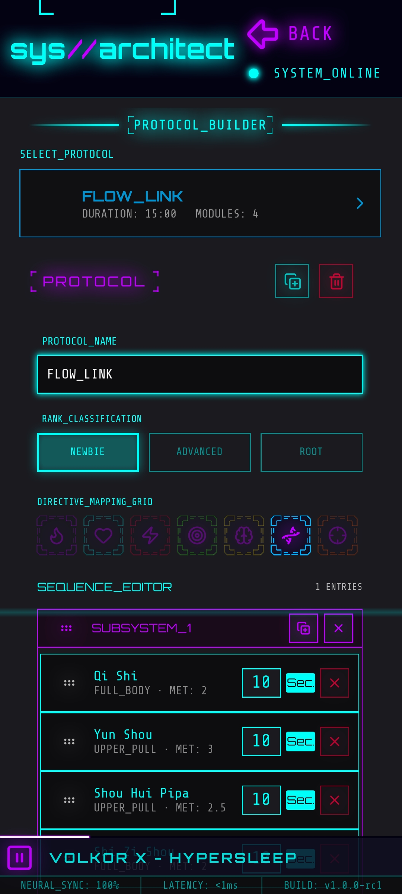

Choose an existing protocol to edit it, or create a new one within the active directive. The editor lets you define its name, rank, and the structure of subsystems (blocks) that make it up.

### Module library and editor

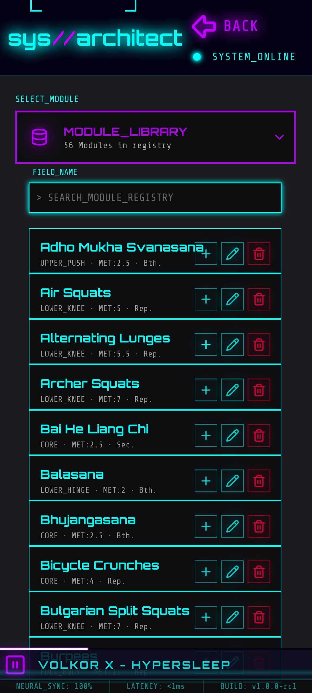
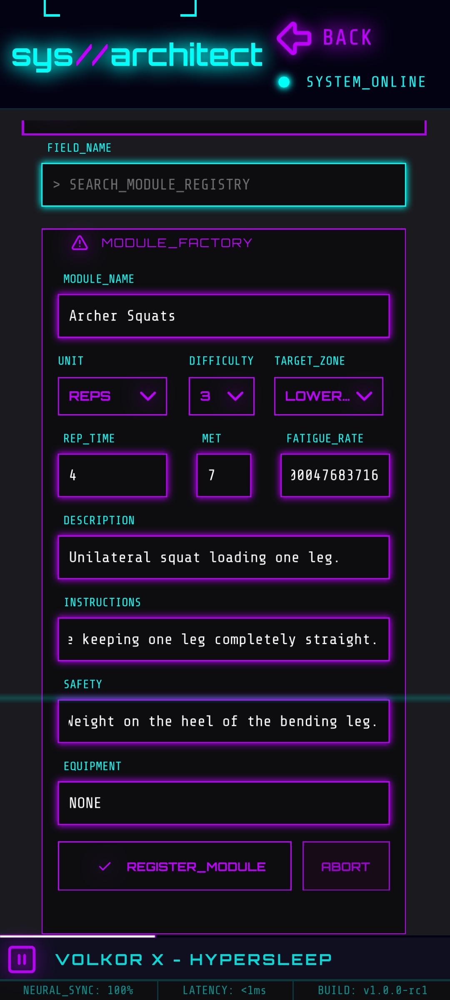

The **module library** gathers all available exercises. From there you can drag them into a protocol or open the **module editor** to create a new one or adjust its parameters (name, unit, metabolic factor, fatigue rate...).

### Confirmations

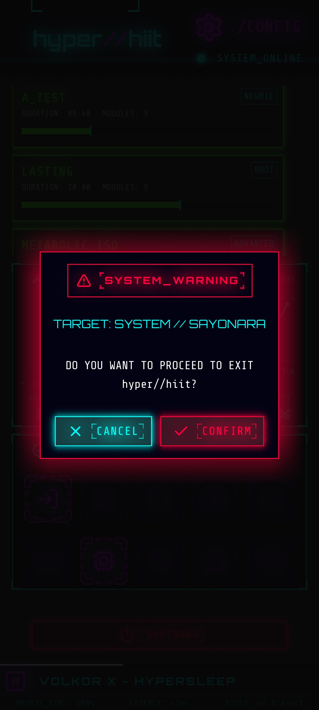

Sensitive actions (such as deleting a protocol or restoring the database) always show a confirmation prompt before executing, to prevent accidental deletions.

---

## 7. Quick tips

- Keep your user data (weight, age...) up to date so calorie calculations stay accurate.
- Only use Architect Mode if you want to customize your routines; it's not required for training.
- Try all three visual themes and pick the one you're most comfortable with.

---

*Manual prepared for the HYPER//HIIT project.*
