# HYPER//HIIT — Manual de Usuario

**Interfaz de Rendimiento Táctico para entrenamiento HIIT**

---

## 1. Bienvenida

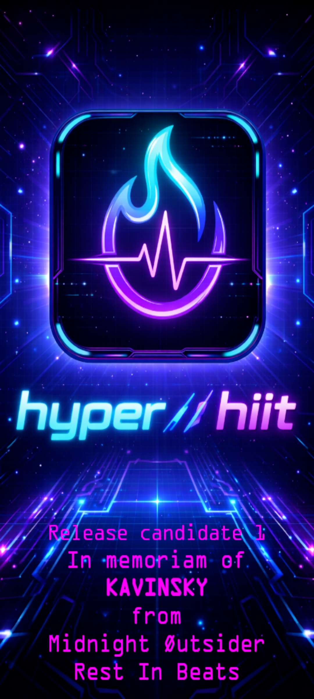

HYPER//HIIT es tu centro de mando para entrenar por intervalos de alta intensidad. Elige una **directiva**, escoge un **protocolo** y ejecútalo mientras la app controla los tiempos, calcula tu gasto calórico y registra tu progreso.

---

## 2. Panel principal (Dashboard)

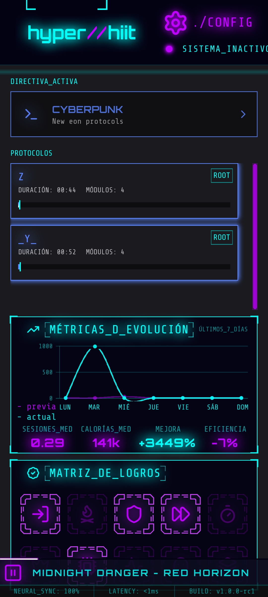

Al abrir la app llegas al **Dashboard**, tu pantalla de inicio. Aquí encontrarás:

- El selector de **directiva** activa (arriba del todo).
- La lista de **protocolos** disponibles para esa directiva.
- Tu **evolución semanal** (calorías, mejora y eficiencia respecto a la semana anterior).
- Tus **logros** desbloqueados.
- El botón **SHUTDOWN**, para salir de la app.
- El icono de engranaje (arriba a la derecha) para entrar en **Configuración**.

### Elegir una directiva

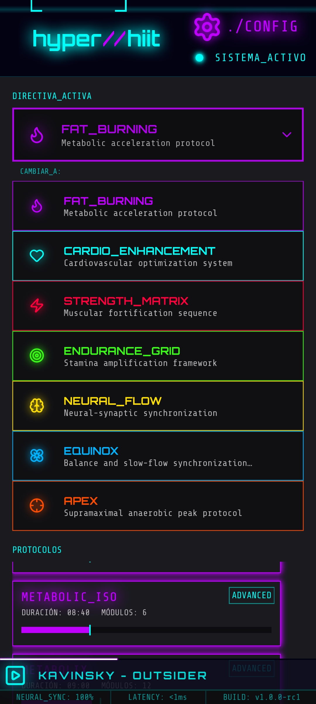

Toca el desplegable superior para ver todas las directivas disponibles (por ejemplo, fuerza, resistencia, quema de grasa, etc.). Al seleccionar una, la lista de protocolos se filtra automáticamente y el color de la interfaz cambia para identificarla.

---

## 3. Tipos de protocolo

Cada protocolo pertenece a un estilo de entrenamiento distinto. Al tocar uno desde el Dashboard, verás su **briefing** (ficha técnica) antes de empezar: rango, número de módulos, duración estimada y calorías previstas.

| Tipo | Descripción |
|---|---|
| **Tabata** | Rondas cortas y muy intensas con descansos breves. Máxima exigencia en poco tiempo. |
| **AFAP** *(As Fast As Possible)* | Completa el volumen de ejercicio marcado al ritmo que puedas mantener. |
| **Otros protocolos** | Directivas como yoga o tai-chi usan sus propias dinámicas (por respiraciones o por tiempo). |

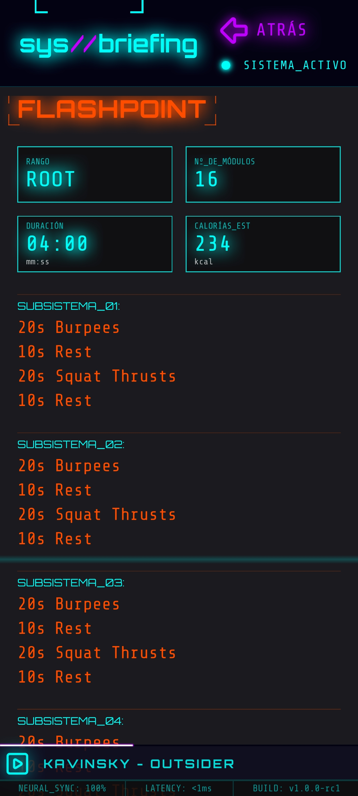
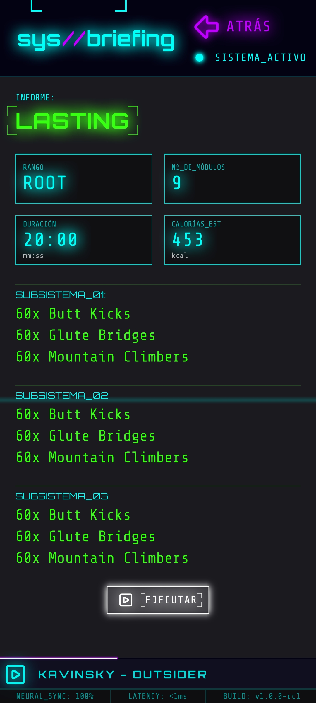
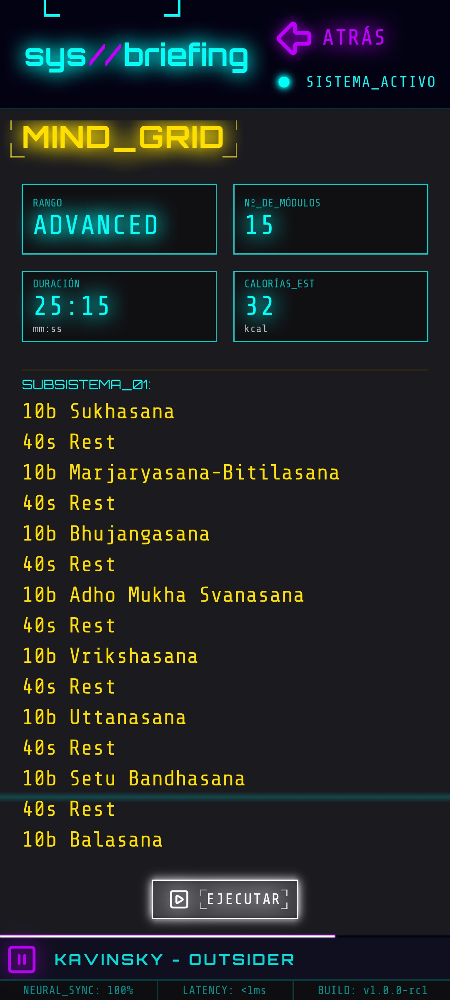

Cuando el briefing te convenza, pulsa **EXECUTE** para comenzar.

---

## 4. Ejecutar una sesión

### Cuenta atrás

Antes de cada sesión hay una cuenta atrás de preparación. Aprovecha para colocarte en posición: en cuanto llegue a cero, arranca el primer módulo.

### Progreso en tiempo real

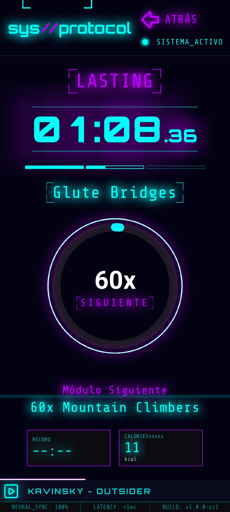

Durante el entrenamiento verás:

- El **módulo actual** (ejercicio) y su cantidad (segundos, repeticiones o respiraciones).
- Un **dial de progreso** que se va llenando hasta completar el módulo.
- El **siguiente módulo** en la parte inferior, para que sepas qué viene.
- El indicador de **subsistema**, que marca en qué bloque de la rutina te encuentras.

Si el módulo se mide por tiempo, avanza solo. Si se mide por repeticiones, avanza al pulsar cuando termines.

### Resumen de la sesión

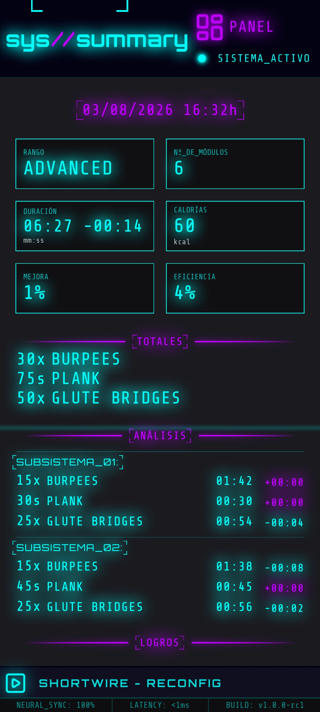

Al finalizar el protocolo llegas al **resumen**: duración total, calorías quemadas, mejora respecto a tu marca anterior, eficiencia y los logros conseguidos en esa sesión.

---

## 5. Configuración

Accede desde el icono de engranaje del Dashboard.

### Datos de usuario

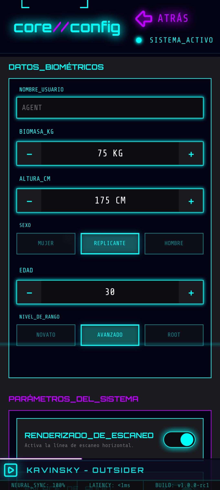

Aquí ajustas tu nombre, peso, altura, sexo, edad y rango (novato, avanzado...). Estos datos afectan directamente al cálculo de calorías, así que conviene mantenerlos actualizados.

### Ajustes del sistema

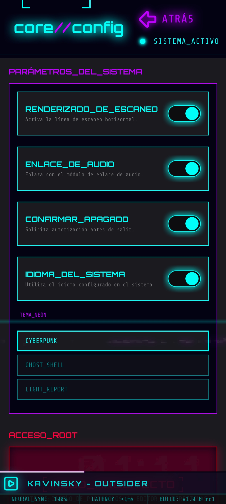

Desde aquí controlas:

- **SCANLINE_RENDER**: activa o desactiva las líneas horizontales del estilo visual.
- **AUDIO_UPLINK**: activa el reproductor de audio de la app.
- **SHUTDOWN_CONFIRM**: pide confirmación antes de salir.
- **SYSTEM_LANGUAGE**: usa el idioma configurado en tu dispositivo.
- **NEON_THEME**: cambia el aspecto visual de la app entre tres estilos: *Cyberpunk*, *Ghost Shell* y *Light Report*.

### Acceso root

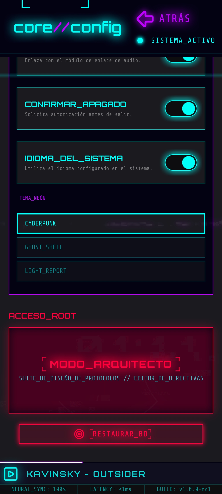

En la parte inferior de Configuración encontrarás la zona de **acceso root**, reservada a usuarios avanzados:

- **ACCESS_ARCHITECT_MODE**: abre el editor de directivas, protocolos y módulos (ver siguiente sección).
- **RESTORE_DB**: borra por completo la base de datos de la app. Esta acción es irreversible, así que úsala con cuidado.

---

## 6. Modo Arquitecto (edición avanzada)

El **Modo Arquitecto** te permite crear y modificar el contenido de entrenamiento de la app: directivas, protocolos y los módulos (ejercicios) que los componen.

### Directivas

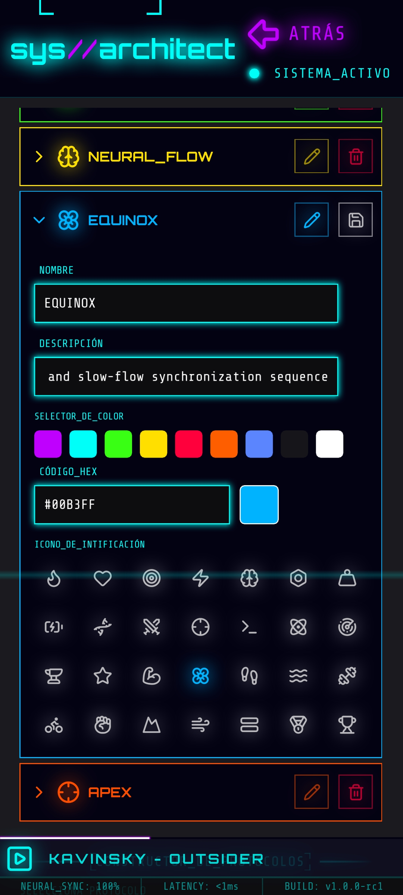

Aquí puedes crear nuevas directivas o editar las existentes: nombre, descripción, color e icono. Al tocar una, se despliegan sus protocolos asociados.

### Seleccionar y editar protocolos

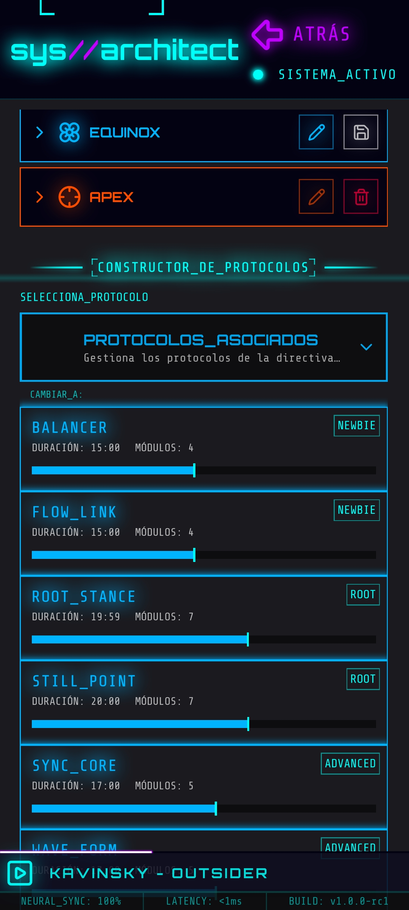

Elige un protocolo existente para editarlo o crea uno nuevo dentro de la directiva activa. En el editor defines su nombre, rango y la estructura de subsistemas (bloques) que lo componen.

### Biblioteca y editor de módulos

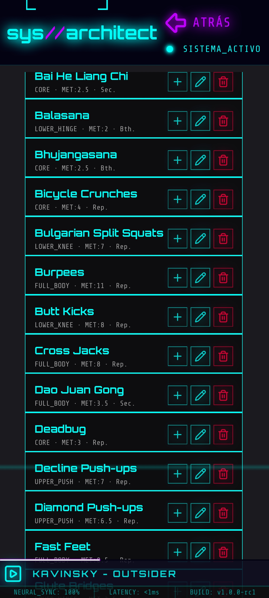
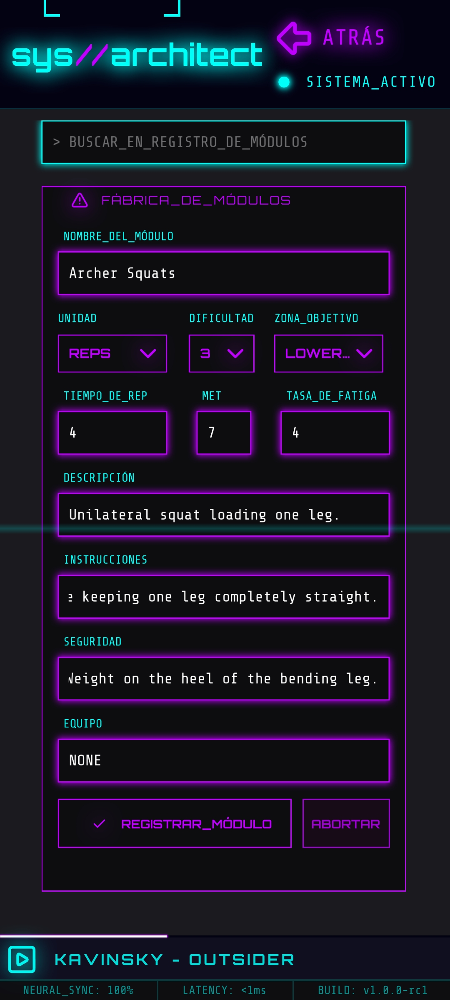

La **biblioteca de módulos** reúne todos los ejercicios disponibles. Desde ahí puedes arrastrarlos a un protocolo o abrir el **editor de módulo** para crear uno nuevo o ajustar sus parámetros (nombre, unidad, factor metabólico, factor de fatiga...).

### Confirmaciones

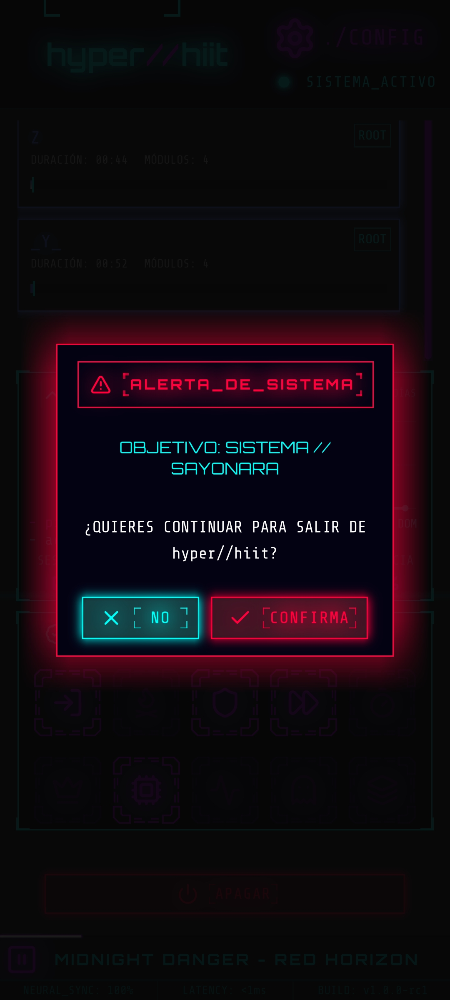

Las acciones sensibles (como borrar un protocolo o restaurar la base de datos) siempre muestran un aviso de confirmación antes de ejecutarse, para evitar borrados accidentales.

---

## 7. Consejos rápidos

- Mantén tus datos de usuario (peso, edad...) actualizados para que el cálculo de calorías sea preciso.
- Usa el Modo Arquitecto solo si quieres personalizar tus rutinas; no es necesario para entrenar.
- Prueba los tres temas visuales y elige el que te resulte más cómodo.

---

*Manual elaborado para el proyecto HYPER//HIIT.*
