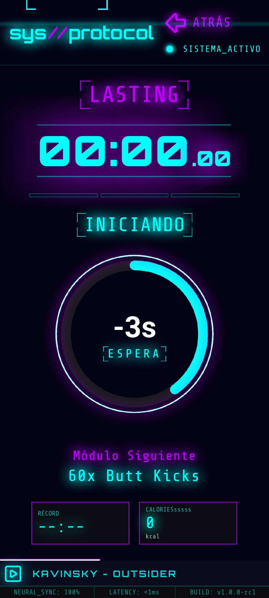
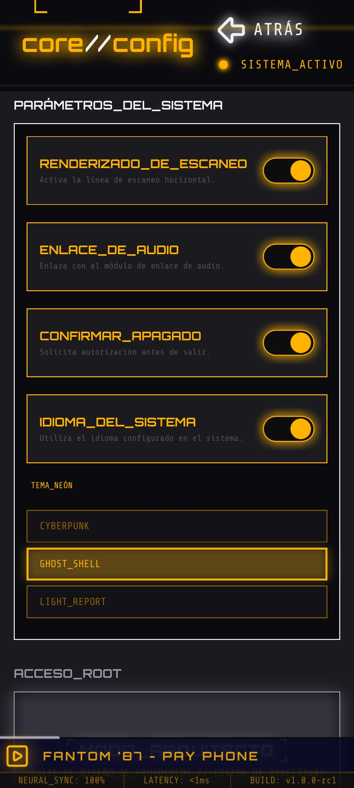
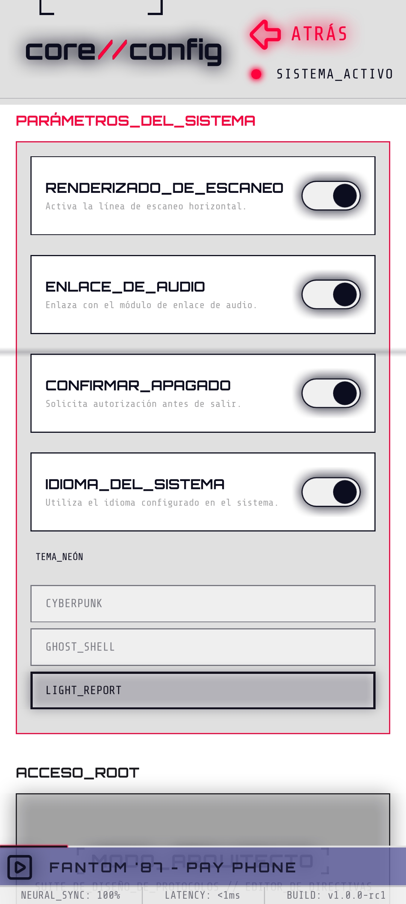
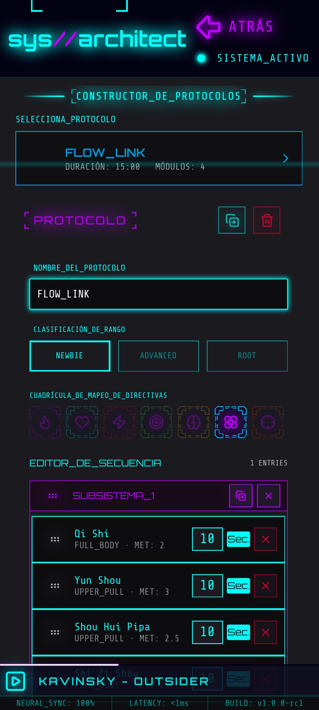

# HYPER//HIIT

> A tactical, terminal-inspired HIIT training companion built with **Qt6/QML** and a **C++** backend.

> HYPER//HIIT is a free, highly configurable open-source software suite designed for HIIT protocol execution and performance tracking. Built to monitor and log your progression through custom tactical training milestones.

&nbsp;

## Screenshots

| Splash | Dashboard | Protocol Execution |
|:---:|:---:|:---:|
|  |  |  |

| Config — Ghost Shell theme | Config — Light Report theme | Architect — Protocol editor |
|:---:|:---:|:---:|
|  |  |  |

&nbsp;

## Overview

HYPER//HIIT is a HIIT (High-Intensity Interval Training) tracking app with a dark, neon "cyberpunk" terminal aesthetic. Training content is organized into a three-tier structure — **Directives → Protocols → Modules** — stored as a structured, relational-style array so new exercises and workouts can be added without touching the rendering code.

The interface is designed to minimize cognitive load during high-intensity sessions: a single continuous mission timer drives the whole flow, rest and transition periods are handled as regular modules rather than separate app states, and protocol cards use dynamic visual grouping (`subsistema_id`) to segment each workout into clear phases.

## Features

- **Directive Navigation** — browse and expand training directives (e.g. `FAT_BURNING`, `STRENGTH_MATRIX`, `NEURAL_FLOW`) with status icons and descriptions.
- **Protocol Execution Engine** — runs a protocol's modules in sequence (exercises, rest, transitions) driven by a single unified mission timer.
- **Evolution Metrics** — 7-day rolling dashboard with `IMPROVEMENT`, `EFFICIENCY`, `AVG_SESSIONS` and `AVG_CALORIES`, calculated from session history.
- **Achievement Matrix** — unlockable milestones and personal records (PB) per protocol.
- **Audio Uplink** — in-app mini-player with progress bar, integrated into the technical footer.
- **CORE_CONFIG & ARCHITECT** — in-app settings, plus an editor to create and edit directives, protocols and modules without redeploying.
- **Selectable Neon Themes** — switch the whole UI between skins such as `CYBERPUNK`, `GHOST_SHELL` and `LIGHT_REPORT`.

## Tech Stack

- **UI:** QML (declarative), custom dark/neon theming
- **Backend:** C++ (Qt6)
- **Data:** local structured array / JSON-backed data model (directives, protocols, modules, session history)

## Architecture

The data model follows a relational-style structure:

- **Modules** — the atomic building blocks (an exercise, a rest period, a transition), each with a `unitat_tipus` (e.g. repetitions or seconds) that tells the engine how to interpret its numeric value.
- **Protocols** — ordered sequences of modules, grouped visually into subsystems via `subsistema_id`.
- **Directives** — collections of protocols sharing a training focus (e.g. cardio, strength, mobility).
- **Session History** — completed sessions, used to compute rolling performance metrics.

For the full technical breakdown — metrics formulas, the JSON schema, UX rules and the version roadmap — see [`architecture-report.md`](./architecture-report.md).

## Getting Started

```bash
# clone the repository
git clone <repo-url>
cd hyper-hiit

# build with Qt6 / CMake
mkdir build && cd build
cmake ..
cmake --build .
```

> Adjust the build instructions above to match your actual build system if it differs.

## Roadmap

Development is staged from `v0.1` (core terminal shell) through `v1.0` (full system online), prioritizing a usable training MVP early (`v0.4`) before layering on metrics, achievements, audio, and configuration tooling. See the [Version Roadmap](./architecture-report.md#version-roadmap) in the architecture report for the complete breakdown.

## Documentation & Guidelines

Please refer to the `Documentation/` folder for architectural principles and design standards.

## License

This project is licensed under the **GNU General Public License v3.0** - see the LICENSE file for details.

---
*Developed for tactical training optimization.*

